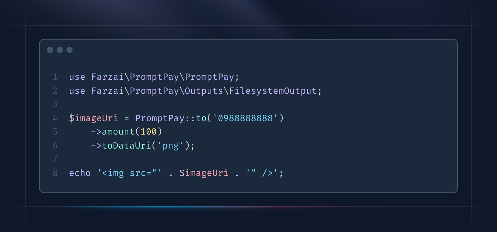

# PromptPay QR Code Generator - PHP

[](https://packagist.org/packages/farzai/promptpay)
[](https://github.com/farzai/promptpay-qr-php/actions/workflows/run-tests.yml)
[](https://codecov.io/gh/farzai/promptpay-qr-php)
[](https://packagist.org/packages/farzai/promptpay)

This library that allows you to create PromptPay QR codes. 
You can generate a QR code for receiving payments through PromptPay, which is a popular payment method in Thailand.


## Requirements

- PHP 8.0 or higher

## Installation (For CLI)


You can install the package globally via composer:

```bash
composer global require farzai/promptpay
```
Make sure to place Composer's system-wide vendor bin directory in your $PATH so the promptpay executable can be located by your system. 
This directory exists in different locations based on your operating system;
however, some common locations include:


For macOS
```
$HOME/.composer/vendor/bin
```

For GNU / Linux Distributions
```
GNU / Linux Distributions: $HOME/.config/composer/vendor/bin
```

For Windows
```
%USERPROFILE%\AppData\Roaming\Composer\vendor\bin
```

## Usage
```bash
promptpay 0988888888 --amount 100
```


---


## Installation (For PHP Application)



You can install the package via composer:

```bash
composer require farzai/promptpay
```

## Usage

```php
use Farzai\PromptPay\Generator;

$generator = new Generator();

$qrCode = $generator->generate(
    target: "098-888-8888", 
    amount: 100
);

// Next, you can save the image to a file:
$qrCode->save('qrcode.png');

// Or insert it directly into a template:
echo 'asDataUri() . '" />';
```

## Testing

```bash
composer test
```

## Changelog

Please see [CHANGELOG](CHANGELOG.md) for more information on what has changed recently.

## Contributing

Please see [CONTRIBUTING](https://github.com/spatie/.github/blob/main/CONTRIBUTING.md) for details.

## Security Vulnerabilities

Please review [our security policy](../../security/policy) on how to report security vulnerabilities.

## Credits

- [parsilver](https://github.com/parsilver)
- [All Contributors](../../contributors)

## License

The MIT License (MIT). Please see [License File](LICENSE.md) for more information.
